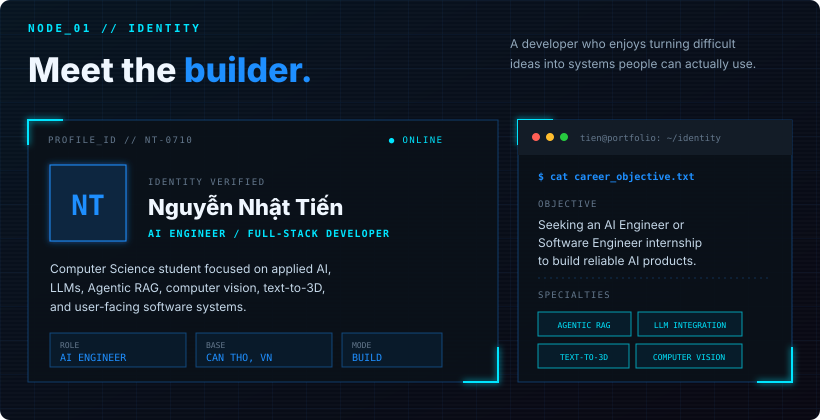
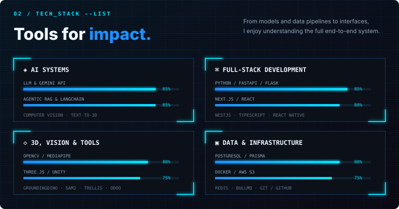
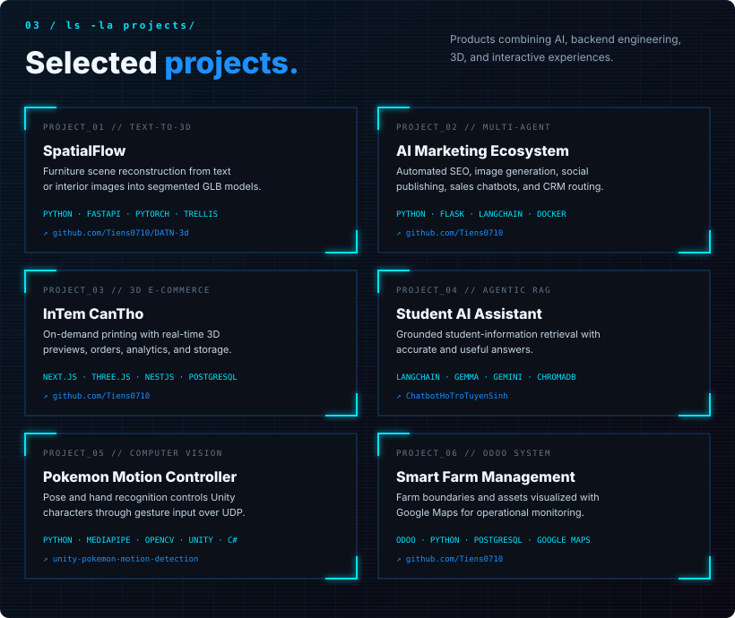
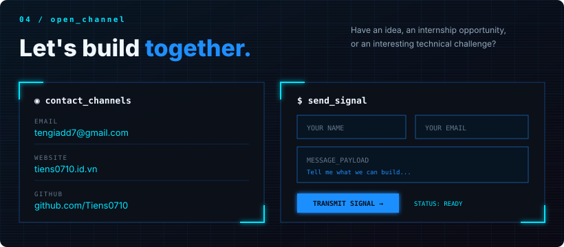

  
  
  

 

<code>read identity data</code>

 

Computer Science student at Can Tho University of Technology, focused on applied AI, LLMs, Agentic RAG, computer vision, text-to-3D, and user-facing software systems.

**Role:** AI Engineer &nbsp;·&nbsp; **Base:** Can Tho, Vietnam &nbsp;·&nbsp; **Mode:** Build / Learn

 

<code>inspect tech stack</code>

 

`Python` · `PyTorch` · `LangChain` · `Gemini API` · `OpenCV` · `TypeScript` · `React` · `Next.js` · `FastAPI` · `NestJS` · `Three.js` · `Unity` · `Odoo` · `PostgreSQL` · `Redis` · `Docker`

 

<code>open project nodes</code>

 

- [SpatialFlow — Text-to-3D Furniture Scene Reconstruction](https://github.com/Tiens0710/DATN-3d)
- [Student AI Assistant — Agentic RAG](https://github.com/Tiens0710/ChatbotHoTroTuyenSinh)
- [Pokemon Motion Controller — AI &amp; Unity](https://github.com/Tiens0710/unity-pokemon-motion-detection)
- [All repositories](https://github.com/Tiens0710?tab=repositories)

 

  <a href="mailto:tengiadd7@gmail.com">EMAIL</a> &nbsp;·&nbsp;
  <a href="https://tiens0710.id.vn/">WEBSITE</a> &nbsp;·&nbsp;
  <a href="https://github.com/Tiens0710">GITHUB</a>

<code>root@tien:~$ echo "Thanks for stopping by. Let's build something."</code>

