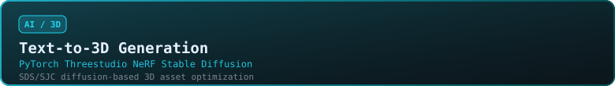
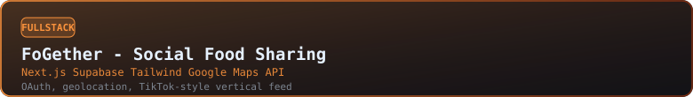
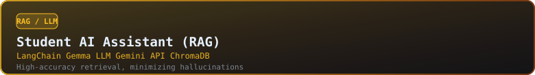
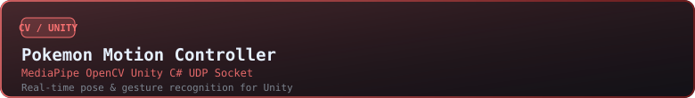
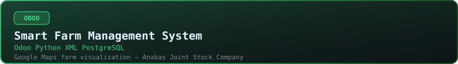

<div align="center">


<p>
  <code>AI ENGINEER</code> &nbsp;/&nbsp; <code>FULL-STACK DEVELOPER</code>
</p>

<p>
  Computer Science student building applied AI systems, Agentic RAG pipelines,<br/>
  computer-vision tools, text-to-3D workflows, and useful full-stack products.
</p>

<p>
  <a href="https://tiens0710.id.vn/"></a>
  <a href="mailto:tengiadd7@gmail.com"></a>
  <a href="https://github.com/Tiens0710"></a>
</p>

</div>


<br/>

<div align="center">



</div>

<br/>

## `01 / IDENTITY`

<table>
  <tr>
    <td width="58%" valign="top">

### `profile_id // NT-0710`

**Nguyễn Nhật Tiến**<br/>
`AI ENGINEER / FULL-STACK DEVELOPER`

Computer Science student at Can Tho University of Technology, focused on applied AI, LLMs, Agentic RAG, computer vision, text-to-3D, and user-facing software systems.

| Signal | Current state |
| --- | --- |
| **ROLE** | AI Engineer |
| **BASE** | Can Tho, Vietnam |
| **MODE** | Build / Learn |
| **ACADEMIC WINDOW** | 2022—2027 |

    </td>
    <td width="42%" valign="top">

### `career_objective.txt`

> Seeking an AI Engineer or Software Engineer internship to build reliable AI products.

**Experience**<br/>
Odoo and smart-farm management systems, including Google Maps integration for operational monitoring.

**Specialties**<br/>
`Agentic RAG` &nbsp; `LLM integrations`<br/>
`Text-to-3D` &nbsp; `Computer Vision`

    </td>
  </tr>
</table>

<br/>

## `02 / TECH_STACK --LIST`

**AI / ML**


**Full-stack**


**Data / infrastructure**


<br/>

## `03 / ls -la projects/`

<div align="center">

<a href="https://github.com/Tiens0710/DATN-3d"></a>

**SpatialFlow — Text-to-3D Furniture Scene Reconstruction**<br/>
`Python` · `FastAPI` · `PyTorch` · `Diffusers` · `TRELLIS`

<br/>

<a href="https://github.com/Tiens0710"></a>

**Autonomous AI Marketing &amp; E-Commerce Ecosystem**<br/>
`Python` · `Flask` · `Playwright` · `LangChain` · `Docker`

<br/>

<a href="https://github.com/Tiens0710"></a>

**InTem CanTho — Interactive 3D E-Commerce**<br/>
`Next.js` · `React` · `Three.js` · `NestJS` · `PostgreSQL` · `Redis`

<br/>

<a href="https://github.com/Tiens0710/ChatbotHoTroTuyenSinh"></a>

**Student AI Assistant — Agentic RAG**<br/>
`Python` · `LangChain` · `Gemma` · `Gemini API` · `ChromaDB`

<br/>

<a href="https://github.com/Tiens0710/unity-pokemon-motion-detection"></a>

**Pokemon Motion Controller — AI &amp; Unity**<br/>
`Python` · `MediaPipe` · `OpenCV` · `Unity` · `C#` · `UDP`

<br/>

<a href="https://github.com/Tiens0710"></a>

**Smart Farm Management System**<br/>
`Odoo` · `Python` · `XML` · `PostgreSQL` · `Google Maps`

</div>

<br/>

## `04 / open_channel`

<table>
  <tr>
    <td width="50%" valign="top">

### `contact_channels`

**EMAIL**<br/>
[tengiadd7@gmail.com](mailto:tengiadd7@gmail.com)

**WEBSITE**<br/>
[tiens0710.id.vn](https://tiens0710.id.vn/)

**GITHUB**<br/>
[github.com/Tiens0710](https://github.com/Tiens0710)

    </td>
    <td width="50%" valign="top">

### `certificates.log`

```diff
+ Software Engineer Intern — HackerRank
+ Prompt Engineering — Coursera
+ Foundations of Cybersecurity — Coursera
+ TOEIC 735 — CTUT
+ Graduate with Honors — Starknet Foundation
+ Python (Basic) — HackerRank
```

    </td>
  </tr>
</table>

<br/>

<div align="center">

<code>root@tien:~$ echo "Thanks for stopping by. Let's build something."</code>

</div>


